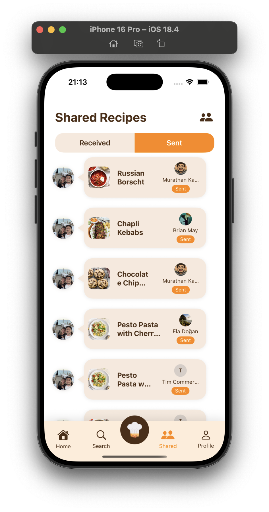

# Ingreedy 🍳
Turn the ingredients you have into meals you’ll love with a little help from AI.

Ingreedy is an iOS app that helps home cooks quickly figure out what to cook, discover new recipes, and share favorites with friends. It combines a delightful SwiftUI experience with an AI assistant (Gemini) that understands your pantry, preferences, and constraints.

---

## What Ingreedy Does 

- **Transforms your ingredients into ideas**: Tell Ingreedy what you have, and it suggests recipes or simple dishes you can make right now.
- **Suggests smart substitutions**: Missing an ingredient? Ingreedy recommends realistic swaps and alternatives.
- **Personalizes to your taste**: It learns your dietary preferences, disliked ingredients, and cooking style.
- **Helps you discover recipes**: Browse featured and popular recipes tailored to your context.
- **Makes cooking social**: Share recipes with friends, see what they’re cooking, and swap inspiration.

---

## Who It’s For

- **Busy people** who don’t want to think too hard about dinner.
- **Beginner cooks** who need guidance and substitutions.
- **Food lovers** who enjoy finding and sharing great recipes.
- **Health-conscious users** managing diets and ingredients.

---

## How It Works

1. **Start with what you have**  
   Enter your ingredients or pick from suggestions. The AI understands the context (e.g., “eggs, spinach, feta”).

2. **Get instant meal ideas**  
   Ingreedy suggests recipes or quick meals, with options to filter by difficulty, time, or dietary needs.

3. **Adapt with substitutions**  
   Missing an item? Ask for realistic swaps that won’t ruin the dish.

4. **Cook with confidence**  
   View clear steps, tips, and optional AI guidance while cooking.

5. **Share and get inspired**  
   Send recipes to friends and receive theirs in a clean, chat-like inbox.

---

## Key Features

- **AI Ingredient Assistant**: Context-aware suggestions, substitutions, and tips via Gemini.
- **Recipe Discovery**: Featured, popular, and personalized collections.
- **Smart Search**: Find recipes fast by ingredients or cravings.
- **Social Sharing**: Share and receive recipes with friends.
- **Profiles & Settings**: Preferences, notifications, privacy controls.
- **Delightful Design**: Smooth animations, accessible components, and modern SwiftUI UI.

---

## Example Use Cases

- “I’ve got chicken, yogurt, and lemon — what can I make?”
- “I’m out of parmesan — what’s a good substitute?”
- “I need a 20-minute, high-protein dinner.”
- “No nuts and no shellfish — show me options.”
- “Send this pasta to my friend who loves Italian.”

---

## 📸 Screenshots

<p float="left">
  
  
  
</p>

<p float="left">
  
  
  
</p>

<p float="left">
  
   
</p>


---

## Tech Overview

- **Language**: Swift 5+ | **UI**: SwiftUI | **Architecture**: MVVM  
- **AI**: Google Gemini  
- **Backend**: Firebase Auth + Firestore  
- **Networking**: URLSession  
- **Animations**: Lottie  
- **Build**: Xcode 15+, iOS 16+

Project structure highlights:
- `Services/AI/GeminiAIService.swift` — AI prompts and responses  
- `Services/Database/` — Firebase: Auth, Friends, Shared Recipes  
- `Services/Network/RecipeService.swift` — Recipe API calls  
- `ViewModels/` — State + actions per feature  
- `Views/` — SwiftUI screens and components  
- `Utils/` — Styles, router, cache, extensions

---

## Getting Started

1) Clone  
```
git clone https://github.com/<your-username>/Ingreedy.git
cd Ingreedy
```

2) Open in Xcode  
Open `Ingreedy.xcodeproj` (or the workspace under `Ingreedy.xcodeproj/project.xcworkspace`).

3) Configure Firebase  
Download `GoogleService-Info.plist` and place it at `Ingreedy/Ingreedy/GoogleService-Info.plist`.

4) Configure Gemini  
Set your API key in `Ingreedy/Ingreedy/Configuration/GeminiConfiguration.swift`:
```
enum GeminiConfiguration {
    static let apiKey: String = "<YOUR_GEMINI_API_KEY>"
}
```

5) Run  
Select a simulator or device, then Build & Run.

---

## Privacy & Data

- Authentication and social features use Firebase services.
- AI requests are sent to Gemini with only the necessary context.
- Sensitive keys should be kept out of source control; use secure storage or build settings.

---

## Contributing

- Fork → Branch → Commit → PR  
- Keep changes focused and match the existing code style.

---

## Roadmap

- Deeper AI memory for multi-turn cooking context  
- Offline mode and better caching  
- Advanced filters (nutrition, cuisine, difficulty)  
- Richer social features (reactions, comments)


